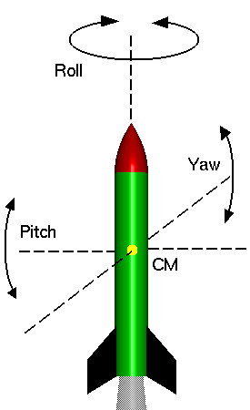

# Ideas
## Thrust Control
2 different control methods
- Assume yaw-pitch controll is independent of roll
	- Since RCS thrust is order of magnitude lower

### Gimball: 2-DOF's TVC
- F = 100 N
- 10-15 degrees
- Centre of gravity-dependent

### Axial rotation: 
- RCS thruster next to centre of gravity (as close to the payload as possible)
- F = 1 N
- Centre of gravity-dependent

## Other
- Gyroscope

# Rocket Structure
Take any rocket from SpaceX
- Default skin mass for both components (in kg/m3)

## Cargo
- 10

## Fuel
- 100
- Full height: h1
- Empty height: 0

So:
- h(t) = h1 - burn_rate * t
- y - h1 = (h1 - 0) / (t_total) * t
	- y = h1 - (h1 / t_total) * t

## engine
- 10

# System

# Tasks
## Task 1:
- Calculate how the centre of mass changes in time
	- Vaishnav & Zubair

## Task 2:
### Task 2.1
- Momentum equilibrium / dynamics equations for the pitch/yaw
	- Gimball position thrust + gravity
- Ani, 

### Task 2.2
- Moment equation for roll and RCS stuff related

## Task 3:
- Control for the vector controlled thruster
	- Igor

## Task 4:
- Control for the RCS

## Task 6:
- Find data of a real rocket
	- Stage sizes
	- Weight
	- Length